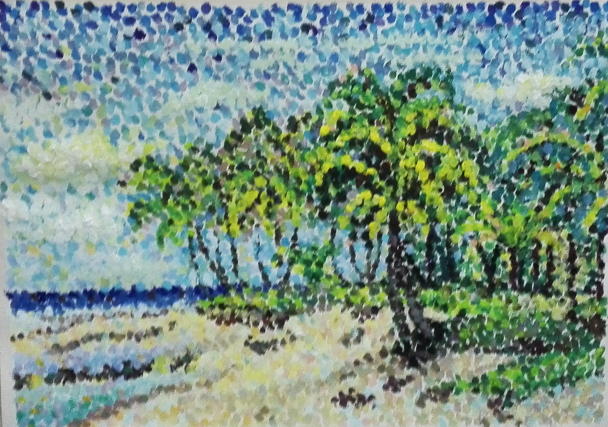
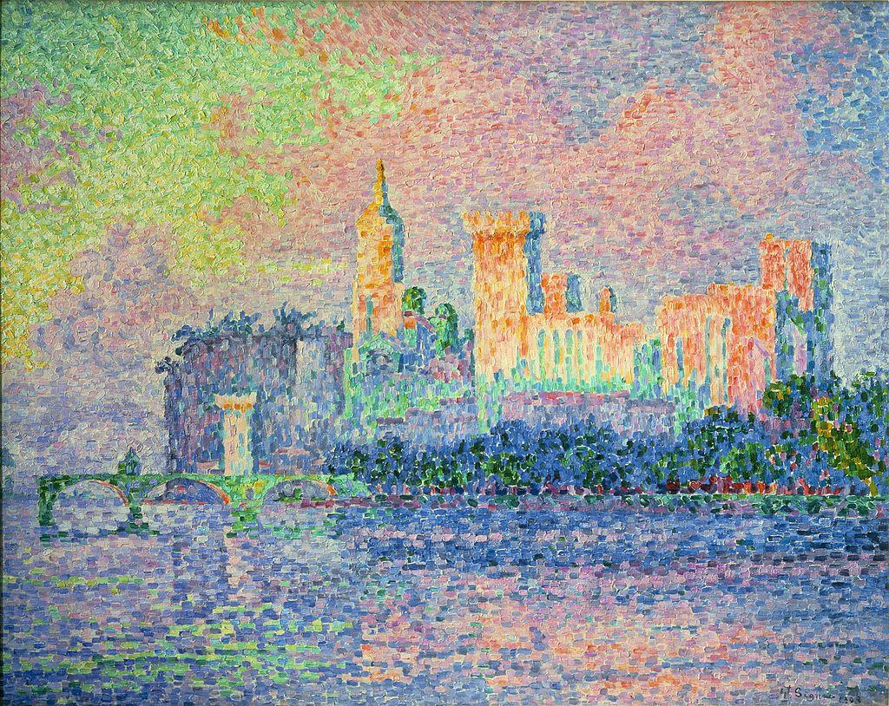
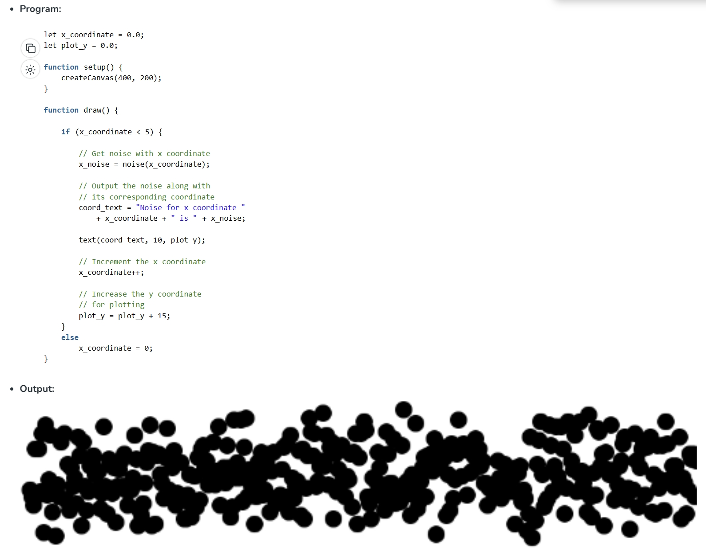

# Week8-QZ

## Imaging Technique Inspiration

I chose the "pointillism" art style, which composes the image using countless dots or color blocks. 

Because the image we chose for our final project also primarily features circles and has vivid colors with a hand-painted feel, adopting the pointillism style will make the visual impact even more striking.

Moreover, pointillism can enhance the effect of our animation by allowing each dot to undergo small, random variations. Paired with rich colors, the entire image will exhibit a strong sense of breathing.

## Coding Technique Exploration

Using Perlin noise, by applying it to both the position and color of the dots, not only can each dot move naturally and continuously around its original position, but the variation in colors also enhances the visual richness, making it highly suitable for creating dynamic pointillism effects. Compared to simple random functions, the changes are much more natural.

*Link*
[Link Text](https://www.geeksforgeeks.org/p5-js-noise-function/)

